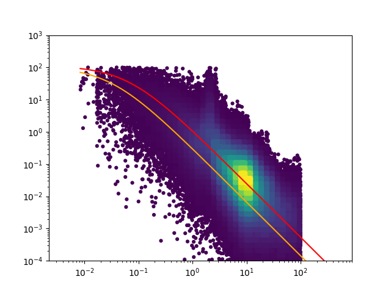

# spectral_fitting
This repository performs spectral analysis of ADV data to include in PyTurbSim. 

# Working with this repo
When starting to work with this repo, run these scripts in this order to get all data up-to-date:

    pull_data.py
    process_data.py
    plot_results.py

Next, run the single_fit_u.py, single_fit_v.py, and spectral_fit_w.py scripts to generate turbulence spectra and
corresponding fit parameters for the corresponding components. The final result of running the single_fit_u.py script
is the following image.

The red line is the fit based on parameters a=113 and b=16 that is returned from the script. The orange line is the fit
based on Walter et. al where a=105 and b=33.
